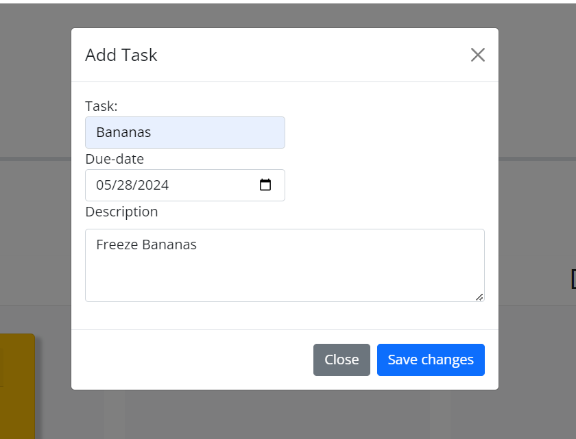
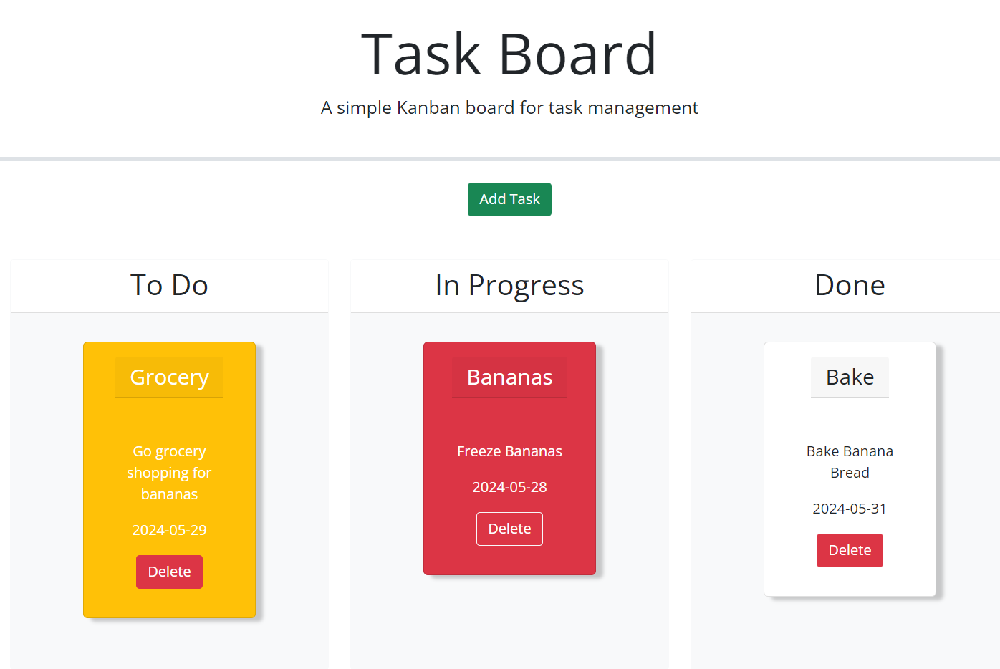

# Task-Board

## Description

The deployed project is a task board to input and save tasks to keep up with a to-do-list. The functionality includes color coding of tasks that are near their deadline, past-due and on-time. They are also sorted into three columns to sort which tasks have not been started, one's that are in progress and completed. 

## Usage

Click the button to add tasks to task board. Enter Title, Date, and Description.

Drag and Drop tasks to the appropriate column for the status of the task.

## License

Please review License in Repo.
